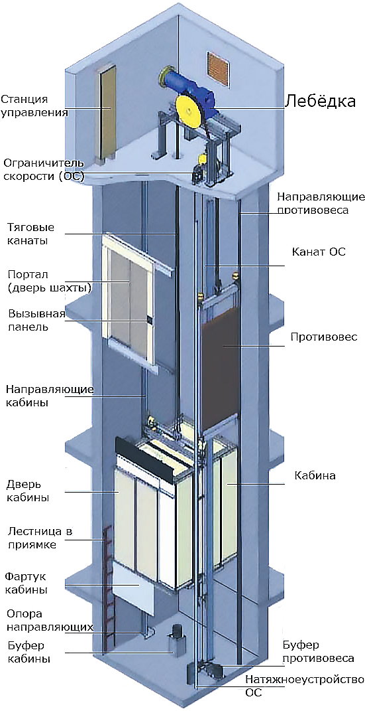
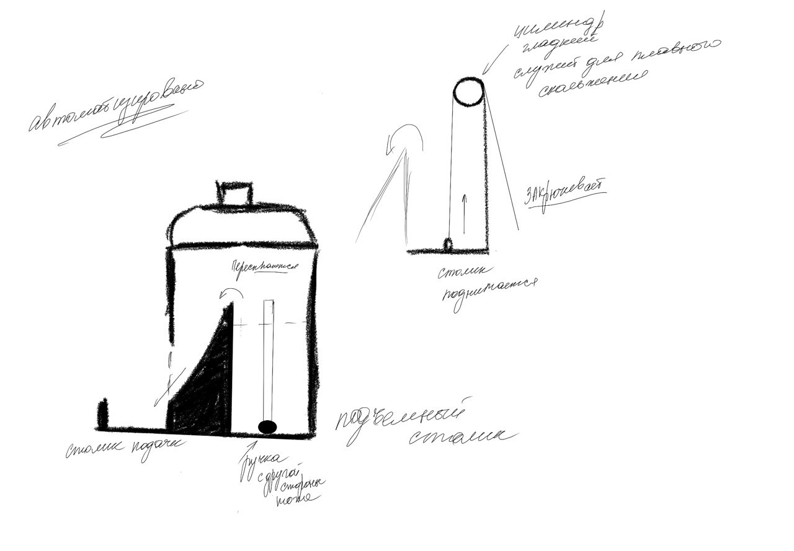
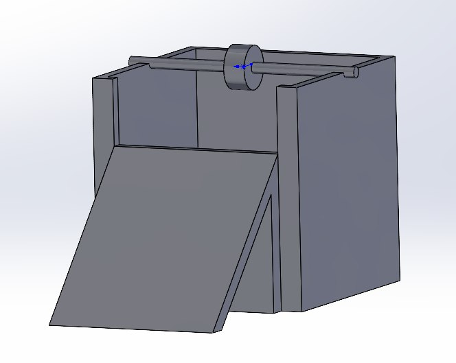
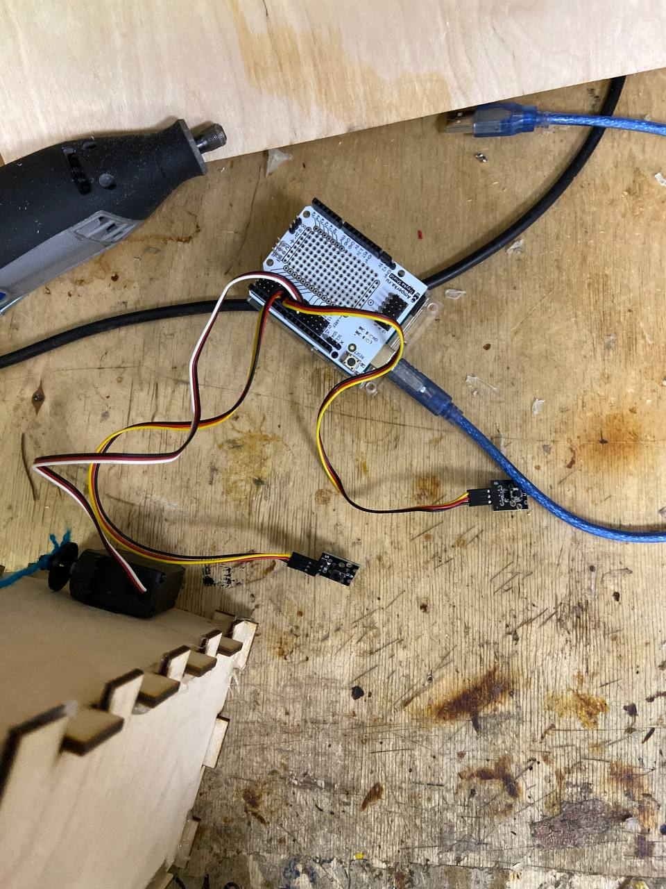

# PET

## Нароботки
Концепт был изначально похожий на лифт-лототрон.



Рисунок 1 - Концепт 



Рисунок 2 - Эскиз

## 3D-модель


Рисунок 3 - 3D-модель

## Электроника
* Сервопривод
* Arduino Uno
* Troyka Shield
* 2 кнопки



Рисунок 4 - Электроника

## Изготовление и сборка

## Code
```c++
// Библиотека с расширенными функциями для работы с Servo
    #include <AmperkaServo.h>
     
    // Создаём объект для работы с сервомоторами
    AmperkaServo servo;
    #define BTN1 7
    #define BTN2 6

     
    // Задаём имя пина, к которому подключён сервопривод
    constexpr uint8_t SERVO_PIN = 9;
     
    void setup() {
      pinMode(BTN1, INPUT);
      pinMode(BTN2, INPUT);
      servo.attach(SERVO_PIN, 544, 2400);
    }
     
    void loop() {
      int btnVal = digitalRead(BTN1);
      int btnVal1 = digitalRead(BTN2);
  if(btnVal == 0 && btnVal1 == 1){
      // Задаём максимальную скорость вращения по часовой стрелке CW
      servo.writeSpeed(255);
      delay(1500);
      servo.writeSpeed(0);
    }
  else if(btnVal == 1 && btnVal1 == 0){
     // Задаём максимальную скорость вращения против часовой стрелки CCW
       servo.writeSpeed(-255);
      delay(1500);
      servo.writeSpeed(0);
     }
     
  }
```
## Результат

[Видео](https://github.com/Eblyaev/PET/blob/main/Процесс.mp4)

## Недостатки

* Нет конкретного концепта
* Слишком грязно выполнено
* Есть куда расти 
